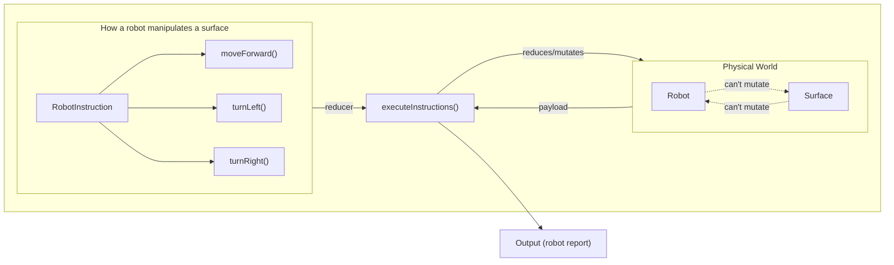

https://github.com/marceloclp/challenge-martian-robots/assets/8413171/908bb547-6e19-4c94-a938-7a49a08a98b5


# Getting Started

```bash
nvm use && pnpm install && pnpn run dev
```

Open [http://localhost:3000](http://localhost:3000) or click [here](https://challenge-martian-robots.vercel.app/) to see the result.

# Solution

The solution is structured into three main entities/classes:

- `Surface`s, which hold state about the terrain of a planet (such as things
  that have been placed in it, like the scent left by a robot), and what
  positions are out of bounds. Its responsibility is to abstract away any implementation
  details on how a planet's terrain is shaped (be it a flat surface, a circular
  array or a graph with holes in the middle) and expose a simple, universal way
  of interacting with any type of surface.
- `Robot`s, which hold state about its positioning and rotation inside an abstract
  surface. Robots on their own can't interact with or manipulate Surfaces - and
  the inverse is also true. In fact, they are not even aware of what surface they
  are on. The only thing they keep track of is their positioning and rotation.
  Its responsibility is to abstract all the implementation details on how a
  physical thing could transverse and rotate in a 2d physical surface.
- and finally `RobotInstruction`s, which are what bridges robots and surfaces,
  and define how a robot manipulates a surface. A robot instruction is a well
  defined sequence of steps a robot takes. It's like a reducer: take a snapshot
  of a Robot and a Surface in any moment in time, apply an instruction, and that
  will give you the next state of the robot and the surface. Instructions are
  the only thing that can update Robots or Surfaces.



```ts
const allowedInstructions = [
  moveForwardInstruction,
  turnLeftInstruction,
  turnRightInstruction,
]
executeInstructions(
  new Surface2d(5, 3),
  new Robot2d(0, 0, 'N'),
  'FFFRFRFFLFRFLL',
  allowedInstructions,
)
```

The strongest point of this solution is that all parts are decoupled - let's say
that Mars is no longer a rectangular shaped surface, but an irregular flat
surface with holes in it. To be able to check if `(x, y)` is within its surface,
we would require a much more complex data structure (perhaps a graph).

Although the implementation details of the Surface may change overtime, since it's
decoupled from the rest of the solution, no changes will have to be done to the
rest of the codebase. Regardless of whether we simply perform a boundaries check,
or the existence of `(x, y)` in an adjacency matrix/graph, `surface.isOutOfBounds()`
is not going to change.

The same thing applies to Robots, whose only responsibility is to expose the
required API for someone to be able to transverse and rotate in a 2d world.
Perhaps they can now rotate in 45deg increments instead of just 90deg - the rest
of the codebase doesn't care, nothing has changed from their point of view.

## What I focused on

For the main solution of the problem I focused the most on making sure that
each layer is decoupled, easily extensible and replaceable, as mentioned above.

This approach also attempted to model the entities closely to what they would be
like in real-life. A Robot is its own entity, a physical thing that can move
when placed on a surface or rotate towards a different direction. A surface is
any piece of terrain, which can have stuff placed into it, or removed. And finally
an instruction represents an action: how a robot will interact with a surface.

The last goal was to make things just generic enough so that they can extensible.
This is why I choose to use more generic wording such as `Surface2d` instead of
`MarsSurface`. There may be any number of planets that are flat and bound by a
rectangular area. A Mars' Surface is simply an instance of a `Surface2d` with
specific dimensions. By being less specific, we are able to expand the solution
in many directions - supporting other types of planets, supporting different types
of terrain, and so on.

Unless I missed something, I found the question to be fairly easy and straight
forward, although I found some of the wording tricky (we can discuss it more later).
It doesn't seem like there are many edge cases or particular sub-problems that
deserve closer attention.

It took me around 30min to reach a working solution that I thought was good, and
so I decided to put more time into exploring other areas that could help me
demonstrate technical expertise. Although this was not the focus, I choose to
put extra focus on the frontend, as this was completely left to subjective opinion,
and I believe it can help demonstrate technical expertise, good taste and attention
to detail.

This includes things like:

- Global and local state management
- Demonstrating how my solution could be consumed by a client
- Optimization techniques to demonstrate a solid understanding of component
  lifecycles and the core APIs in React
- Decent UI/UX, CSS/JS animations, SVG manipulation, etc

I also choose not to focus on other things, given the constraint of time, such
as accessibility, responsiveness, routing, server actions, front-end testing
and so on.

## Libraries choice & other decisions

Here is why I choose some of the packages I did:

- **[TailwindCSS](https://tailwindcss.com/docs/installation)** is a great tool
  for quickly prototyping UIs, with amazing defaults (like beautiful colors, a
  well-thought out spacing system, etc) that make it extremely quick to build
  out great looking UIs in a very small time frame.
- I choose **[valtio](https://valtio.pmnd.rs/docs/introduction/getting-started)**
  for my state management package, being extremely small at just a little over 3kB.
  The main benefit of valtio is performance through fine-grained control of what
  state components subscribe to. State exists both inside and outside components,
  and valtio understands this and lets you mutate state from both places. The
  additional benefit we get from this is that callbacks/event handlers can almost
  ever be defined outside components, making them **always stable**.
- I choose not to use a library like `react-hook-form` as the forms in this
  project were small and require almost no validation. But I still embraced the
  performant nature of `react-hook-form` through uncontrolled components.

## Features

- Pan-capable surface viewer
  - Positions whose robots have left a scent will be colored in orange
  - Edit the surface's width/height
- Animated robot traverse and rotations
  - The robot moves in the surface grid as the instruction is executed
- Animated instructions display
  - When an instruction goes outside the display, it is scrolled into view
  - When an instruction is skipped, it will have an orange circle
  - When an instruction is invalid, it will have a red circle
  - Pause/resume instructions
- List of all reports by previous robots
