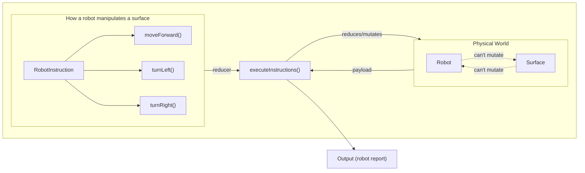

https://github.com/marceloclp/challenge-martian-robots/assets/8413171/908bb547-6e19-4c94-a938-7a49a08a98b5


# Getting Started

```bash
nvm use && pnpm install && pnpn run dev
```

Open [http://localhost:3000](http://localhost:3000) or click [here](https://challenge-martian-robots.vercel.app/) to see the result.

# Solution

The solution is structured into three main entities/classes:

- `Surface`s, which hold state about the terrain of a planet (such as things
  that have been placed in it, like the scent left by a robot), and what
  positions are out of bounds. Its responsibility is to abstract away any implementation
  details on how a planet's terrain is shaped (be it a flat surface, a circular
  array or a graph with holes in the middle).
- `Robot`s, which hold state about the position and rotation inside an abstract
  surface. Robots on their own can't interact with or manipulate Surfaces - and
  the inverse is also true. Its responsibility is to abstract all the
  implementation details on how a thing could transverse and rotate in a 2d
  physical surface.
- and finally `RobotInstruction`s, which are the bridge between robots and
  surfaces. A Robot Instruction defines how a robot interact and manipulates a
  surface by consuming both APIs.



This is similar to the Flux architecture (used by Redux), where a robot instruction
is equivalent to an action, and the robot and surface are the payload.

The strongest point of this solution is that all parts are decoupled - let's say
that Mars is no longer a rectangular shaped surface, but an irregular flat
surface with holes in it, we would require a much more complex data structure
to keep track of what is surface and what is not - like a graph. Although the
implementation has changed significantly, it doesn't matter to the other parts
of the codebase, because they will still be checking whether a coordinate is
out of bounds or not through the same `surface.isOutOfBounds()`. A big change
like this would most likely result in minimal changes to the rest of the codebase.

The same thing applies to Robots, whose only responsibility is to expose the
required API for someone to be able to transverse and rotate in a 2d world.

## What I focused on

For the main solution to the problem I focused the most on making sure that
every thing is decoupled, and easily extensible and replaceable. As mentioned
on the explanation above, it's easy to swap out the implementation of the surface,
or the implementation of the robot, without having to change the entire codebase.

The approach also attempts to model the entities closely to what they would be
like in real-life. A Robot is its own entity, a physical thing which can move
when placed on a surface or rotate towards a different direction. A surface is
any piece of terrain, which can have stuff placed into it, or removed. A robot
can interact with the terrain to see what's in front of it, and so on.

Another thing that I focused on was making things generic enough to demonstrate
how an entity could be extended in many different ways without causing breaking
changes everywhere. This is why I choose to use more generic language such as
`Surface2d` instead of `MarsSurface`. There may be any number of planets that
are flat and bound by a rectangular area. A Mars' Surface is simply an instance
of a `Surface2d` with specific dimensions.

Unless I missed something, the question was fairly easy and straight to the point,
although I found some of the wording tricky (we can discuss it more later), but
overall it was fairly easy. It doesn't seem like there are many edge cases or
particular sub-problems that deserve closer attention.

It took me around 30min to reach a good, working solution, so I decided to put
more time into exploring other areas that could help my solution stand out.
Although this was not the focus, I think there are many topics that can help
demonstrate a solid level of understanding of some fundamentals.

This includes things like:

- Global and local state management
- Demonstrating how my solution could be consumed by a client
- Optimization techniques to demonstrate a solid understanding of component
  lifecycles and the core APIs in React
- Decent UI/UX, CSS/JS animations, SVG manipulation, etc

I also choose not to focus on other things, given the constraint of time, such
as accessibility, responsiveness, routing, server actions, front-end testing
and so on.

## Libraries choice & other decisions

Here is why I choose some of the packages I did:

- **[TailwindCSS](https://tailwindcss.com/docs/installation)** is a great tool
  for quickly prototyping UIs, with amazing defaults (like beautiful colors, a
  well-thought out spacing system, etc) that make it extremely quick to build
  out great looking UIs in a very small timeframe.
- I choose **[valtio](https://valtio.pmnd.rs/docs/introduction/getting-started)**
  for my state management package, being extremely small at just a little over 3kB.
  The main benefit of valtio is performance through fine-grained control of what
  state components subscribe to. State exists both inside and outside components,
  and valtio understands this and lets you mutate state from both places. The
  additional benefit we get from this is that callbacks/event handlers can almost
  ever be defined outside components, making them **always stable**.
- I choose not to use a library like `react-hook-form` as the forms in this
  project were small and require almost no validation. But I still embraced the
  performant nature of `react-hook-form` through uncontrolled components.

## Features

- Pan-capable surface viewer
  - Positions whose robots have left a scent will be colored in orange
  - Edit the surface's width/height
- Animated robot traverse and rotations
  - The robot moves in the surface grid as the instruction is executed
- Animated instructions display
  - When an instruction goes outside the display, it is scrolled into view
  - When an instruction is skipped, it will have an orange circle
  - When an instruction is invalid, it will have a red circle
  - Pause/resume instructions
- List of all reports by previous robots
